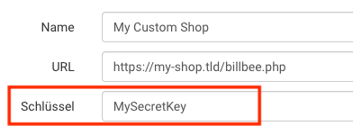

# Adding security for shops
In the most cases you want to restrict the Access to the endpoint for specific users.
The simplest way to do this, is to use the `Billbee\CustomShopApi\Security\KeyAuthenticator`.  
This allows you to set a secret key in the Billbee shop connection settings which 
is getting encrypted and sent with every request




Code example:
```php
<?php
# https://my-shop.tld/billbee.php

use Billbee\CustomShopApi\Http\Request;
use Billbee\CustomShopApi\Http\RequestHandlerPool;
use Billbee\CustomShopApi\Security\KeyAuthenticator;

// Create the request handler pool
$authenticator = new KeyAuthenticator("MySecretKey"); // new
$handler = new RequestHandlerPool($authenticator, [new MyOrderRepository()]);

// Create a PSR-7 Request from the current HTTP Request and pass it to the handler to retrieve a PSR-7 response
$request = Request::createFromGlobals();
$response = $handler->handle($request);

// Send the response to the client
$response->send();
```

In the most cases, this is enough security for your shop connection.

[Back to index](./index.md)